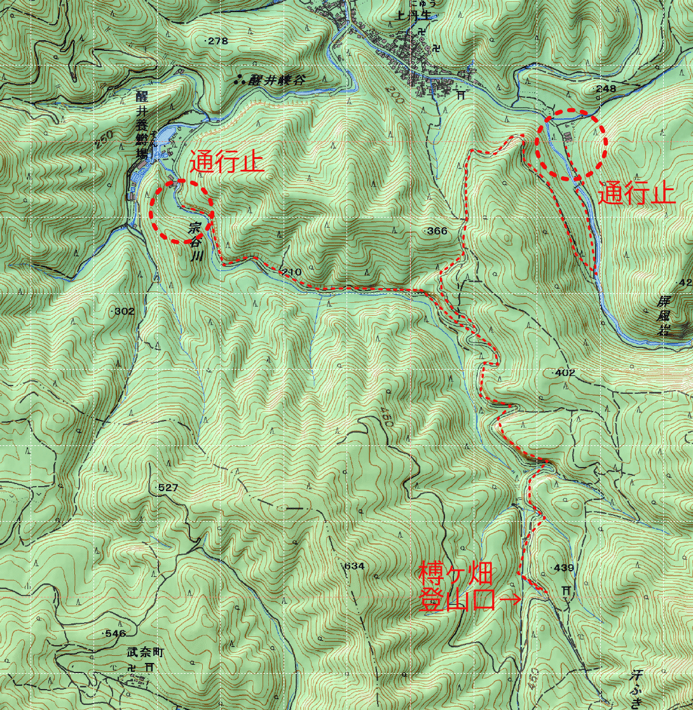
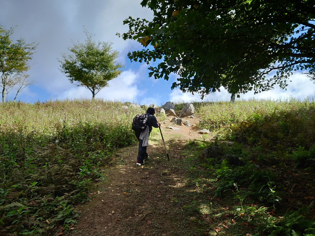

# ~~霊仙山~~高室山日帰り登山

▲高室山山頂

#### 更新履歴
- [x] v1.1 日程決定、装備計画更新（2025-10-10）
- [x] v1.2 食糧計画更新、計画最終化（2025-10-11）
- [x] v1.3 匿名化、web公開（2025-10-11）
- [x] v1.4 装備点検完了（2025-10-12）
- [x] v1.5 当日行き先変更（霊仙山→高室山）（2025-10-13）
- [x] v1.6 報告更新（2025-10-13）

---
## 計画書（霊仙山登山で計画）
### 趣旨・目的

滋賀県にある標高1,000m台とは思えないほどの森林限界地帯、カルスト地形の広大な見通しを誇る霊仙山に登ります。起伏ある平原に石が生える、異世界のような風景を楽しみます。

| 項目       | 内容                         |
| :--------- | :--------------------------- |
| 山名・標高 | 霊仙山（1,083m）             |
| 場所       | 滋賀県米原市/多賀町          |
| 概要       | カルスト地形の高原           |
| 歩行距離   | 約7.2km                      |
| 高低差     | 累計登攀約570m、同下降約570m |
| 予定時期   | 2025-10-13 (月・祝) 雨天中止 |

▲霊仙山

### 参加者・連絡先

| 役割   | 名前 | 年齢 | 性別 | 連絡先 |
| :----- | :--- | :--- | :--- | :----- |
| ガイド | N    | 45   | M    | ---    |
|        | T    | 8    | M    | ---    |

#### 関係連絡先

| 続柄 | 名前 | 連絡先 |
| :--- | :--- | :----- |
| 妻   | A    | ---    |

### 行動計画

|      |   時刻    | アクション/ウェイポイント                                                              |
| :--- | :-------: | :------------------------------------------------------------------------------------- |
| DAY1 |   06:15   | 自宅出発(車移動)                                                                       |
|      | **07:30** | 榑(くれ)ヶ畑登山口到着、**登山出発**                                                   |
|      |   09:00   | 榑ヶ畑道五合目・見晴台到着                                                             |
|      |   10:30   | 榑ヶ畑道八合目・お池到着 昼食・休憩、**ここで折り返し** 霊仙山最高点には行かない |
|      |   11:30   | 下山開始                                                                               |
|      |   13:00   | 榑ヶ畑道五合目・見晴台到着                                                             |
|      | **14:30** | 榑ヶ畑登山口到着 **山行終了**、車移動帰路出発                                       |
|      |   16:30   | 自宅到着、片付け                                                                       |

#### 地域概念図

▲霊仙山広域図

▲霊仙山ルート図（白点線は10秒）

▲霊仙山標高差断面図（片道分のみ）

[国土地理院地形図(クリックで開きます)](https://maps.gsi.go.jp/#12/35.282762/136.393204/&base=std&ls=std&disp=1&vs=c1g1j0h0k0l0u0t0z0r0s0m0f1)

[ルート情報(クリックで開きます)](https://www.yamareco.com/modules/yamareco/detail-8504890.html)

### 食糧計画

|      | 食事   | 献立           | 材料 | 調理方法 |
| :--- | :----- | :------------- | :--- | :------- |
| DAY1 | 朝食   | パン・おにぎり | RM   | N/A      |
|      | 昼食   | パン・弁当     | RM   | N/A      |
| ALL  | 行動食 | 飴・ナッツ等   | RM   | N/A      |
| ALL  | 非常食 | カロリーメイト | RM   | N/A      |

#### （食糧特記事項）
- 今回は軽量化のため湯沸かし道具を持参しません。そのため食事も調理不要のものを選択します。
- 熱中症・痙攣予防に行動中は塩分、ミネラル分を積極的に補給します。

### 医療計画
下記物品をファーストエイドボックス1個に入れ、携行します。

| 名称                       | 員数 | 1回量 | 使い方                                 |
| :------------------------- | :--- | :---- | :------------------------------------- |
| ムヒアルファSII            | 1    | 適量  | 虫さされ                               |
| アンテベート               | 1    | 適量  | 腫れ・炎症抑え                         |
| クロマイ-N                 | 1    | 適量  | 細菌の繁殖をおさえ、化膿を治す         |
| 液体絆創膏 (コロスキン) | 1    | 適量  | 擦り傷・切り傷の消毒・止血             |
| カロナール                 | 4    | 1～2  | 鎮痛剤(子供もOK)                       |
| ロキソニン                 | 2    | 1     | 鎮痛剤(大人だけ)                       |
| 葛根湯                     | 4    | 1     | 風邪のひきはじめを吹き飛ばす(大人だけ) |
| 消毒液                     | 1    | 適量  |                                        |
| ガーゼ                     | 1    | 適量  |                                        |
| サージカルテープ           | 1    |       |                                        |
| はさみ                     | 1    |       |                                        |
| ピンセット                 | 1    |       |                                        |
| つめきり                   | 1    |       |                                        |
| 綿棒                       | 5    |       |                                        |
| 絆創膏(ケアリーヴM)        | 10   |       |                                        |
| スピール膏                 | 5    | 1     | イボやウオノメに使う                   |
| サラテクト50               | 1    | 適量  | マダニ・ヤマビル・ブユ・蚊の忌避剤     |

### 装備計画
- [x] ザック
- [x] 登山靴
- [x] 山着（ズボン、シャツ、厚めの靴下）
- [x] 着替え（シャツ、靴下、下着など）
- [x] 雨具（カッパ）上下
- [x] タオル
- [x] [水4L以上](https://www.yodobashi.com/product/100000001001864307/)（水場なし）
- [x] 割り箸
- [x] ロールペーパー
- [x] スマホ（[Geographica](https://geographica.biz/)をインストール）
- [x] モバイルバッテリ＋ケーブル
- [x] 食糧・行動食（内容は**食糧計画**参照）
- [x] ナイフ
- [x] ステッキ
- [x] 印刷した1/25,000 地形図 x2
- [x] [コンパス](https://www.yodobashi.com/product/100000001001857090/)
- [x] ファーストエイドボックス（内容は**医療計画**参照）
- [x] カシオ　プロトレック（高度計）
- [x] カメラ（PENTAX KP+20-40mm DA limited）

#### （装備特記事項）
- 今回は軽量化のため湯沸かし装備を持参せず、食事も調理不要のものを選択します。

### 気象
- 前日18時時点の[当該地域の天気予報](https://tenki.jp/forecast/6/28/6020/25214/)で降水確率**50%以上**であれば、中止または延期します。
- **装備計画**のとおり、降雨に備え、雨具（カッパ）上下、タオルを各自持参します。
- 行動中、周辺に積乱雲の顕著な発達を確認した場合は、[当該地域の雨雲レーダー](https://tenki.jp/radar/6/28/)などから降水帯の距離・移動方向及び速度を推定してパーティーが落雷・降雨・川の増水などの影響を受ける可能性を評価し、雨具着用や予定変更、ビバークなど適切な行動をとります。

### 記録体制
- スマホアプリ([Runkeeper](https://runkeeper.com/ja/)など)にて、GPXログを取得します。昼食時などは測定停止可。
- 写真・動画撮影は自由に行います。

### その他
- [米原市役所・クマ目撃情報](https://www.city.maibara.lg.jp/mtibuki/about_tozan/attention/20571.html)
- [クマ出没情報ブログ(滋賀県)](http://sukeroku.blog55.fc2.com/blog-category-52.html)

---
## 報告書

### 【当日の行先変更（霊仙山→高室山）】

- 霊仙山の榑ヶ畑登山口へのアプローチ中に、上丹生集落・醒井養鱒場から先の2つの道がいずれも通行止めで、アプローチ不可であることが判明しました。徒歩でのアクセス可ですが、往復約10kmのロスとなるため、行き先を近傍の**高室山**（818m）に変更しました。  
- 高室山は、霊仙山からみて南方向へ約7kmの距離にある山。一回り小ぶりで、標高も1,000mに満たないけれども、山頂付近では霊仙山と同様のカルスト地形を楽しめること、行程も往復約5km、高低差約600mとコンパクトなため、当日代替の行き先として妥当と判断します。  
- 10時登山開始、13時引き返しリミット、**下山リミット17時**（日没17:20）と設定。

#### 高室山ルートの概要

| 項目       | 内容                |
| :--------- | :------------------ |
| 山名・標高 | 高室山（818m）      |
| 場所       | 滋賀県多賀町        |
| 概要       | カルスト地形の高原  |
| 歩行距離   | 約5.0km             |
| 高低差     | 累計登攀約600m      |
| 実施日     | 2025-10-13 (月・祝) |

####　霊仙山のアプローチ道通行止めの記録

▲榑ヶ畑登山口アプローチ道通行止め箇所

### 参加者

| 役割   | 名前 | 年齢 | 性別 | 連絡先 |
| :----- | :--- | :--- | :--- | :----- |
| ガイド | N    | 45   | M    | ---    |
|        | T    | 8    | M    | ---    |

#### 関係連絡先

| 続柄 | 名前 | 連絡先 |
| :--- | :--- | :----- |
| 妻   | A    | ---    |

### 行動記録

| 日付       | 時刻  | アクション/ウェイポイント                                  | 標高(m) |
| :--------- | :---: | :--------------------------------------------------------- | :------ |
| 2025-10-13 | 06:55 | 自宅出発                                                   |         |
|            | 08:45 | 上丹生集落到着 登山道アクセス路不通判明 高室山に変更 |         |
|            | 09:55 | 佐目自然公園到着、**登山開始**。ALT:246m                   | 246     |
|            | 12:00 | 標高700m                                                   | 700     |
|            | 12:30 | **山頂到着**、昼食 ALT:818m                                | 818     |
|            | 13:25 | 下山開始                                                   |         |
|            | 14:55 | おやつ休憩 ALT:480m                                        | 480     |
|            | 15:10 | 再出発                                                     |         |
|            | 16:30 | **下山**、山行終了、 佐目自然公園出発                   | 246     |
|            | 19:30 | 帰宅                                                       |         |

#### 地域概念図

▲広域図（高室山）

▲高室山ルート図（白点線は10秒）

▲高室山標高差断面図

[国土地理院地形図(クリックで開きます)](https://maps.gsi.go.jp/#12/35.221082/136.352692/&base=std&ls=std&disp=1&vs=c1g1j0h0k0l0u0t0z0r0s0m0f1)

[ルート情報(クリックで開きます)](https://yamap.com/model-courses/33902)

#### （行動特記事項）

- 上りに2.5時間、下りに3時間かかっているように、下りのスピードが遅かった。Tが体格的にまだまだこれからなことと、**靴がすべりやすかった**ため。杖が非常に役に立ったが、現状の日帰り登山ではこのコースが**長さ・勾配ともに限度**か。本人の達成感はとてもあったようなので良かった。

### 医療報告

- 使用した物品は以下の通り。補充の必要なし。

| 名称                       | 使用量 | 使用理由                            |
| :------------------------- | :----- | :---------------------------------- |
| 液体絆創膏 (コロスキン) | 適量   | Nの左親指付け根の小さい切り傷の治療 |
| サラテクト50               | 適量   | 蚊・ヤマビル避けのため使用          |

#### 補充・買い替えの必要性

- なし

### 装備報告

- 持参した装備は上記「計画」の通り。
- **自作の杖**は熱収縮ゴムの滑り止めの具合がよく、使いやすかった。
- 熊鈴は、あったほうが良いか。耳障りでない音色のものがあれば欲しい。

#### 損耗・紛失した装備

- なし

### 気象報告

| 項目 | 状況   |
| :--- | :----- |
| 天気 | 晴れ   |
| 風向 | 北西   |
| 風速 | 3-4m/s |
| 積雪 | なし   |

### 食糧報告

|            | 食事   | 献立                                                                                              | 調理方法 |                    |
| :--------- | :----- | :------------------------------------------------------------------------------------------------ | :------- | :----------------- |
| 2025-10-13 | 朝食   | N:昆布おにぎり、メロンパン（白餡）、ミニスナックゴールド T:薄皮チョコパン4個入、ロールカステラ | RM       | 行きの車内で食べた |
|            | 昼食   | N:ピザフォッカチャ、アップルパイ、ミックスナッツ T:ハンバーグ弁当、フランスパン                | RM       | N/A                |
|            | 行動食 | マシュマロ、ヨーグレット、チョコベビ、ミックスナッツ、じゃがりこ                                  | RM       | N/A                |
|            | 非常食 | カロリーメイト                                                                                    | RM       | 消費せず           |

### GPXファイル

- GPXロガーの起動を失念していたため、記録できず。

### 振り返り

- 行程を通して涼しい風が吹き抜け、快適だった。最も良い時期に登ったと思う。服装は歩行中はシャツ1枚にズボン、山頂は吹きさらしになるのでマウンテンパーカを羽織り、体温低下を防いだ。動物の気配はほとんどなかった。蚊・マダニ・ヤマビルの被害は虫除けの忌避効果があったのか、なかった。

### アルバム

▲山頂の少し手前、カルスト高原地形の始まり。標高約750m

▲山頂からの眺め。南西（琵琶湖）方向

▲山頂からの眺め（北方向）。正面が霊仙山、奥に少し見えるのが伊吹山

▲山頂から西方向。南彦根・甲良・豊郷の市街と琵琶湖、奥に比良山系

▲標高637m付近の[林道との交差点](https://maps.gsi.go.jp/#16/35.217602/136.347392/&base=std&ls=std&disp=1&vs=c1g1j0h0k0l0u0t0z0r0s0m0f1)。「陳屋」は「陣屋」の誤りか（詳細不明）

▲ヤマシャクヤクの実。初めて見た

---
[EOF]

